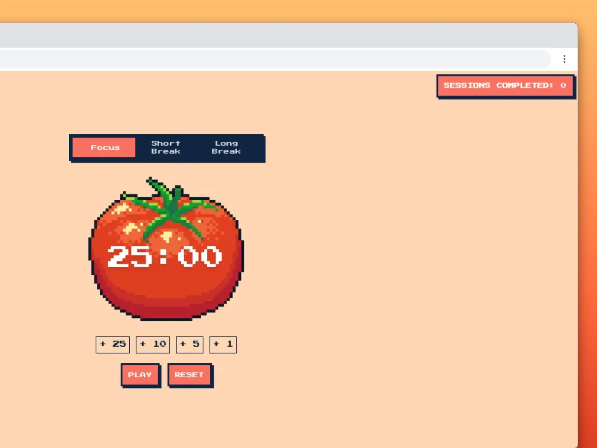

# 🍅 Pomate

Pomate is a productivity timer built with React. This project was created to strengthen frontend development skills through hands-on practice.

The app helps you manage your time efficiently using the Pomodoro Technique — alternating between focused work sessions and short breaks.

## 📸 Preview



**Live Demo:** 
https://pomate.netlify.app

## ⚡ Key Features

- 25 minutes of work, 5 minutes of short break, and a 15-minute long break after every 4 sessions.
- Adjust the length of the sessions to fit your workflow.
- Sound notifications when a session ends.
- Fun interface with a pixel art aesthetic.

## 🧩 Tech Stack

- React (bootstrapped with Vite)
- Bun as runtime and package manager
- Tailwind CSS for styling

## 🛠️ Installation & Setup

1. Clone the repository

```bash
git clone https://github.com/kevsantamaria/pomodoro-app.git
cd pomodoro-app
```

2. Install dependencies

```bash
npm install
```

3. Start the development server

```bash
npm run dev
```
4. Open in your browser

```
http://localhost:5173
```

---

Build with ❤️ by <a href="https://github.com/kevsantamaria">Kevin Santamaria</a>
